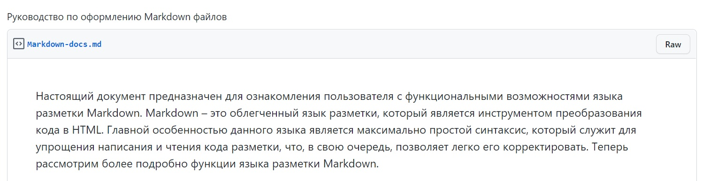

# Инструкция GIT

## Начальная работа с системой контроля версий. 
Команды:

*git --version* - команда для проверки версии git

*git init* - инициализация пустого репозитория

*git status* - проверка текущего состояния файлов

*git add* - добавление версионности файлу

*git commit -m "Сообщение"* - команда для фиксации изменений файлов

*git log* - вывод истории комитов в хронологическом порядке

*git diff* - вывод изменений на текущий момент по отношению к последнему комиту

*git checkout master* или *git checkout хеш-номер_комита* - переход между изменениями либо возврат к текущему состоянию

Ещё есть две команды для знакомства с GIT:
* *git config --global user.name "Имя Фамилия"* - введение вашего имени
* **git config --global user.email "почта"* - введение вашей электронной почты
***
> Настоящий документ предназначен для ознакомления пользователя с функциональными возможностями языка разметки Markdown. Markdown – это облегченный язык разметки, который является инструментом преобразования кода в HTML. Главной особенностью данного языка является максимально простой синтаксис, который служит для упрощения написания и чтения кода разметки, что, в свою очередь, позволяет легко его корректировать. Теперь рассмотрим более подробно функции языка разметки Markdown.

[А здесь ссылка на источник цитаты, которая выше ;)](https://gist.github.com/Jekins/2bf2d0638163f1294637)

Ну и добавляю непосредственно скрин цитаты

*Семинар 2*
# Добавление разметки MarkDown

## Заголовки

## Ссылки
А вот тут я наведу суету :D

## Картинки
Картинка без `alt` текста

Картинка с альтом и тайтлом:

Запомнить просто: синтаксис как у ссылок, только перед
открывающей квадратной скобкой ставится восклицательный
знак.
Картинки «сноски»:
![Картинка][image1]
![Картинка][image2]
![Картинка][image3]
[image1]: //placehold.it/250x100
[image2]: //placehold.it/200x100
[image3]: //placehold.it/150x100
Картинки-ссылки:
[]
(http://example.com/)

## Таблицы